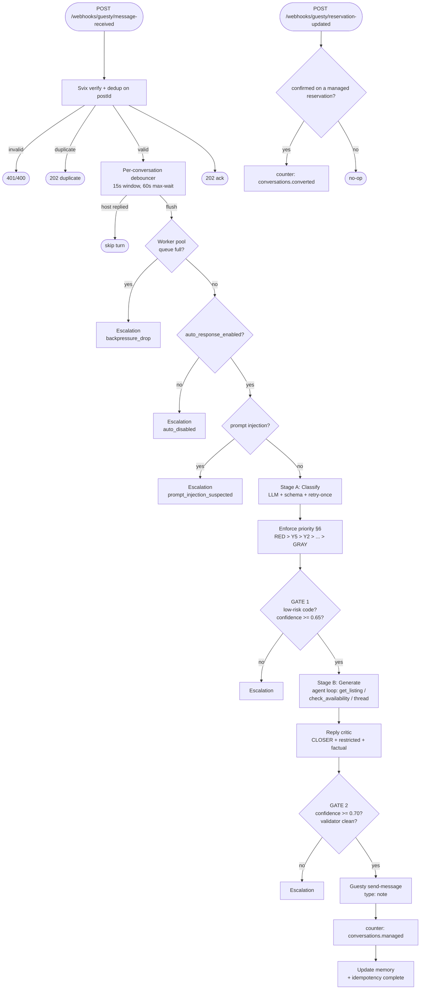

# InquiryIQ

A Go service that reads inbound Guesty guest messages, classifies them with an
LLM, drafts a C.L.O.S.E.R. reply, and **either** auto-sends it as an internal
note **or** escalates to a human — based on deterministic rules, not the LLM's
opinion.

Brief: [`CHALLENGE.md`](./CHALLENGE.md) · Webhook contract:
[`GUESTY_WEBHOOK_CONTRACT.md`](./GUESTY_WEBHOOK_CONTRACT.md)

---

## Run it in 30 seconds

```sh
# One-time toolchain bootstrap (go, golangci-lint, tilt, jq via mise)
mise install

# Secrets: copy the example and drop your LLM key in
cp .env.local.example .env.local   # edit → set LLM_API_KEY=sk-...

# Interactive dev loop: Tilt dashboard with env check, live logs, and
# one-click smoke/unit/lint/eval triggers
make run                           # → http://localhost:10350  (dashboard)
                                   # → http://localhost:4000   (tester UI)
```

`make run` launches Tilt. It preflights `LLM_API_KEY`, brings up Mockoon +
the service + the tester UI through podman-compose, waits for `/healthz`,
and surfaces everything in the dashboard. Code changes under `internal/`,
`cmd/`, `tests/` re-trigger unit/integration tests automatically; there
are manual buttons for `e2e-smoke`, `lint`, and `eval-classifier`.

Need real backends? `make run-prod` does the same inside the full stack
(Mongo + Valkey + Alloy/Tempo/Prom/Grafana, service backends flipped).

Prefer a headless one-shot? `make up` / `make up-prod` bring the stack up
without Tilt and return to the shell.

Top-level entry points:

| Command | What it does |
|---|---|
| `make run` / `make run-prod` | Tilt dashboard — interactive dev loop |
| `make up` / `make up-prod` | Headless compose, prints URLs, returns |
| `make down` / `make down-prod` | Stop the corresponding stack |
| `make env-check` | Pre-flight: fails if `LLM_API_KEY` unset, prints masked env |
| `make e2e-smoke` | Scripted happy-path + escalation smoke against a running stack |
| `make test` / `make test-integration` | Unit + race / integration tests |
| `make check` | `fmt + vet + lint + race-tests` — the full gate |
| `make eval` | Classifier regression against `eval/golden_set.json` |
| `make mise-verify` | Prove the toolchain installs and resolves correctly |

---

## The design decisions that matter

Every decision below answers a specific failure mode. If you're reviewing the
code, these are the points where I'd have pushed back in a design review.

### 1. The LLM is not a judge

The auto-send gate is a **hard rules check** in the application layer, not
a field in the LLM's JSON response. The model classifies (`primary_code`,
`confidence`, `risk_flag`, `extracted_entities`); the code decides.

> **Why:** letting the model approve its own replies is how hallucinated
> send-messages leak to real guests. The gate (`decide.PreGenerate` +
> `decide.Decide`) is a few dozen lines of boolean logic that a human can
> audit. The LLM never sees the toggle state or the price cap.

### 2. Two stages with a cheap gate in between

Stage A (`classify/`) is **one LLM call, strict JSON schema, retry-once**.
Stage B (`generatereply/`) is **an agent loop** against real Guesty tool
calls — `get_listing`, `check_availability`, `get_conversation_history`.

> **Why:** ~80% of turns get rejected at GATE 1 (wrong code, low confidence,
> risk flag). Classifying first means we never pay for the expensive agent
> loop on turns we're going to escalate anyway.

### 3. Webhook acknowledges in milliseconds; everything real runs async

The HTTP handler verifies the Svix signature, dedupes on `postId`, hands the
message to the debouncer, and returns `202`. Classification/generation
happens on a bounded worker pool.

> **Why:** Guesty retries on non-2xx within a few hundred ms. A slow LLM
> provider cannot cascade into webhook-delivery storms. The worker pool
> bounds concurrency so we don't stampede the LLM provider on a burst.

### 4. Debounce per conversation, clamp with a max-wait

Each conversation has a 15-second window (re-armed on every message) with a
hard 60-second ceiling from the first message of the turn.

> **Why:** guests send bursts — `"Hi"` → `"is it free next weekend?"` →
> `"for 4 people"`. Classifying each in isolation produces three bad
> classifications; classifying once when the turn is complete produces one
> good one. The max-wait stops a slow typist from stalling the pipeline
> indefinitely.

### 5. Backpressure never silently drops

When the worker queue saturates, the turn is **rejected to an escalation**
with `reason="backpressure_drop"` and published on the event bus.

> **Why:** the two common alternatives are wrong. Blocking the debouncer
> breaks invariant 3. Dropping silently means an inquiry vanished with no
> audit trail. Escalating surfaces the saturation to both operators (in the
> escalation feed) and dashboards (the counter), so the response is "scale
> the pool" not "guess what broke".

### 6. Every external dependency is a consumer-side interface

Stores, HTTP clients, the clock, the debouncer, the event publisher — all
declared as small unexported interfaces **in the consumer package**, not
re-exported from infrastructure.

> **Why:** Redis, Postgres, or an alt LLM provider drop in by writing a new
> struct in `infrastructure/` that satisfies the interface structurally.
> Zero application-layer changes, zero interface churn. The existing
> `memstore` → `filestore` → `mongostore` swap is exactly this pattern.

### 7. LLM client is provider-agnostic

`infrastructure/llm` wraps `sashabaranov/go-openai` with a configurable
`BaseURL`. DeepSeek is the default; OpenAI or any OpenAI-compatible
endpoint is a one-env-var change.

> **Why:** API compatibility shifts under you. Lock-in to a single
> provider's Go SDK means a rewrite when pricing or availability moves.

### 8. Mocks are real HTTP servers, not in-process fakes

Guesty is stood up as [Mockoon](https://mockoon.com/cli/); the LLM is an
`httptest.Server` with scripted callbacks.

> **Why:** an in-process fake can't catch a bug in status-code handling,
> auth headers, or request serialization. Tests that exercise the real
> HTTP path find real bugs.

### 9. Operator kill-switch with an admin bearer token

`POST /admin/auto-response {"auto_response_enabled": false}` flips the
toggle atomically. Turns arriving while the switch is off short-circuit
**before classification** — zero LLM tokens spent while the switch is off.

> **Why:** incidents need a kill-switch that doesn't require a deploy.
> Short-circuiting before the LLM call means cost-driven incidents (runaway
> tokens, provider billing) are actually contained by the flip, not just
> quieted.

### 10. Automatic daily budget cap

The budget watcher rides on the token recorder. Every LLM call adds USD to
a per-UTC-day tally; breaching `LLM_BUDGET_DAILY_USD` flips the kill-switch
through the same admin path, emits `budget.exceeded` on the bus, and ticks
the `inquiryiq.budget.flips` counter.

> **Why:** humans are bad at noticing gradual overspend. A finance guardrail
> that trips automatically turns a $1000 invoice into a $50 one and a page.
> Self-heals at UTC midnight so it's safe to leave on.

### 11. Event bus for "downstream should care" fan-out

Escalations, conversions, backpressure drops, toggle flips, and budget
trips all publish on an in-process Watermill pub/sub. The default
subscribers just log; production subs can page PagerDuty, post to Slack,
or ship to an analytics warehouse.

> **Why:** the orchestrator shouldn't know about Slack. Adding a notifier
> should be "write a subscriber" not "add a field to the use case".

### 12. Sonar-style lint gate, no suppressions

`funlen 100/50`, `cyclop 30`, `gocognit 20`, `nestif 5`, `dupl 150`. No
`//nolint`, no `#nosec`. Test files are exempt from size/complexity checks
but still lint for correctness.

> **Why:** LLM-generated Go's most common failure modes are 200-line
> functions, deeply nested if-chains, and copy-paste blocks. The gate
> catches them before they ship.

### 13. Server-side memory is the multi-turn source of truth

Each turn appends the guest messages **and** the bot's reply to
`ConversationMemoryRecord.Thread`, and merges extracted entities into
`KnownEntities` (newer non-nil fields win, `Additional` deduped by key).
On the next turn, `priorContext` reads memory first and only falls back
to the webhook `thread` when memory is empty. The classifier and
generator user messages render a deterministic
`known_from_prior_turns:` block so the LLM sees dates, guest count,
pets, vehicles, and listing hints without needing the guest to repeat
them.

> **Why:** Guesty webhooks sometimes arrive with an empty `thread`
> (first-page fetches, the tester UI), and the guest shouldn't have to
> restate dates and headcount on every message. Persisting the exchange
> server-side means "Yes please" can actually resolve against "Want me
> to hold the dates?" instead of re-qualifying from scratch.

### 14. Three independent safeguards stop the reply loop

A single bug shouldn't produce an infinite back-and-forth. Three guards
break the cycle at different layers:

- **Saturation guard** — if classification is X1 (vague) **and** memory
  already holds check-in, check-out, and guest count, escalate with
  `reason="qualifier_saturated"` without running the qualifier LLM.
- **Commitment guard** — pre-classification pattern match: if the
  previous bot turn contained a hold/booking offer ("Want me to hold
  the dates?") **and** the guest reply is a short affirmative ("Yes
  please"), escalate with `reason="commitment_needs_human"`. Fires
  before any LLM call.
- **R-beat prompt ban** — the generator's prompt forbids commitment
  phrasing ("I'll hold", "I've reserved", "the dates are yours")
  unless the same turn calls the `hold_reservation` tool; otherwise
  the model must emit `abort_reason="needs_human_action"`.

> **Why:** any one of these fails closed independently. The guards
> cover the two failure modes we saw in testing — loops from
> re-qualifying past the point of diminishing returns, and loops from
> the bot making promises it couldn't keep.

### 15. Real reservation holds via `hold_reservation` tool

Guesty's `POST /reservations` is exposed through a
`CreateReservation(ctx, in) (ReservationHoldResult, error)` method on
the client, with `status=inquiry` (soft hold, no calendar block) and
`status=reserved` (calendar-blocking). The generator can call the
`hold_reservation` tool in the same turn where it offers a hold,
cite the confirmation code back to the guest, and the reply stops
being a promise.

> **Why:** a bot that says "I'll hold the dates" without actually
> holding them is worse than one that escalates — the guest moves on,
> the dates stay open, and a competing booking wins. Wiring the real
> reservation path means a commitment in the reply is backed by a
> Guesty-side state change, not just a sentence.

### 16. Summary compression on long threads

`MemoryLimits{Cap, Keep}` (defaults 50/20, env-tunable) bound memory
growth. When `len(Thread) > Cap`, the oldest `len(Thread) - Keep`
entries are folded into `LastSummary` via the `summarize` use case
(≤600-char LLM compression, server-capped at 1200). If the summarizer
is absent or errors, `foldOverflow` falls back to plain truncation —
correctness never depends on a successful LLM call.

> **Why:** conversations can run for weeks. Unbounded memory makes
> every subsequent classifier/generator call slower and more expensive;
> losing the oldest context silently is worse. A compressed summary
> keeps the bot grounded in what's happened without paying the
> per-token tax every turn.

---

## Request flow



---

## Layout

```
cmd/
  server/          main.go — wires everything, serves HTTP
  replay/          CLI to re-feed persisted webhooks through the pipeline
  eval/            classifier regression runner
internal/
  transport/http/  handlers, chi router, Svix signature verification, DTOs
  application/     use cases (processinquiry, classify, generatereply,
                   decide, eval, dispatch, trackconversion, reviewreply)
  domain/          entities, codes, sentinel errors; repository/ and mappers/
  infrastructure/  guesty, llm, debouncer, store{mem,file,mongo,redis},
                   telemetry, budget, togglesource, eventbus, clock, obs
fixtures/          Mockoon env + signed-webhook JSON payloads
tests/integration/ end-to-end tests (build tag: integration)
docs/runbooks/     kill-switch, budget-watcher procedures
compose/           observability stack (Alloy, Tempo, Prom, Grafana + dashboards)
```

---

## What I'd build next

- **Durable idempotency and escalation stores.** `memstore`/JSONL is fine
  for the demo; production wants Postgres for escalations and Redis for
  the idempotency set. The interfaces already exist.
- **Notifier subscribers on the event bus.** A Slack webhook on
  `escalation.recorded` + `backpressure.dropped`, a PagerDuty page on
  `budget.exceeded` + `toggle.flipped`. Currently everything logs.
- **Multi-tenant `AccountID` threading.** One instance serves one Cloud9
  account today; wire the tenant through domain types, stores, and metric
  labels.
- **Confidence calibration data.** Log classifier confidence vs.
  accept/reject signal so the 0.65 threshold becomes data-driven.
- **Shadow mode.** Generate replies for turns the operator is reviewing,
  log them, don't send. Builds on the existing event bus.

---

## AI usage, briefly

Built with Claude Code (Anthropic's CLI) via `worktrunk` worktrees, small
atomic commits.

AI accelerated: scaffolding the four-layer structure, the Stage A schema +
validator, the Stage B tool dispatcher, the Mockoon fixtures, and the
integration harness.

I owned: the priority arbiter, the restricted-content rules, the reply
critic's "sell certainty requires availability check" invariant, the
decision to short-circuit the kill-switch before classification, every
rewrite of a `//nolint`-using draft, and the Guesty client's real API
shapes (Claude's first pass used the simplified brief paths).

Verification before commit: `go build`, `go vet`, `golangci-lint` clean;
`go test -race` clean; integration suite (when Mockoon present) clean.
